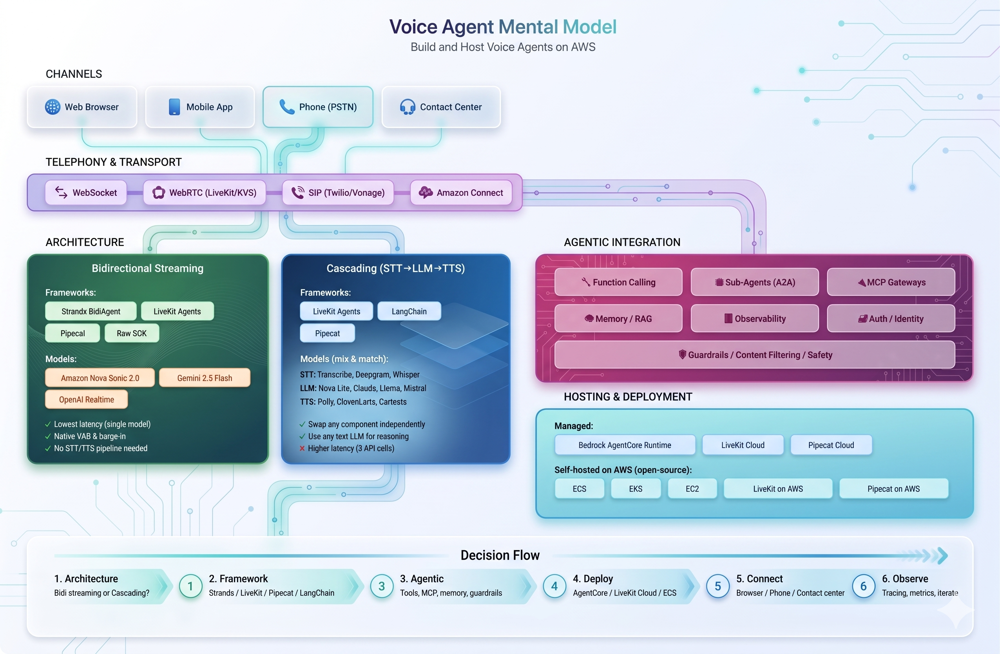
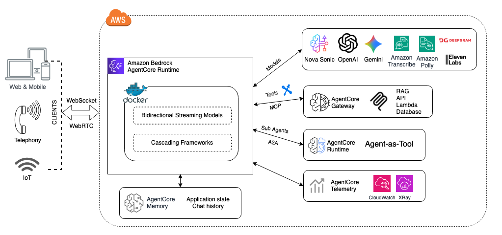

# Build and Host Voice Agents on AWS

Voice AI is moving from simple IVR menus to real-time conversational agents that can reason, call tools, and maintain context across sessions. Two architecture patterns have emerged: **bidirectional streaming** (a single model handles speech in and out natively) and **cascading** (separate STT → LLM → TTS services chained together). Each has tradeoffs in latency, flexibility, and complexity.

This repo provides **working samples** covering both patterns across multiple frameworks (Strands, LiveKit, Pipecat, LangChain, raw Bedrock SDK), with deployment options ranging from Amazon Bedrock AgentCore Runtime to LiveKit Cloud to self-hosted containers on AWS. Samples include function calling, MCP gateway tools, conversation memory, sub-agents, and telephony-ready architectures.

> 🌟 **Featured:** The [strands-sonic](samples/bidi-streaming/strands-sonic/) sample is the most complete solution — multi-model support (Nova Sonic, Gemini, OpenAI), MCP Gateway tools, AgentCore Memory for conversation persistence, A2A sub-agents, configurable profiles, and full AgentCore Runtime deployment. Start here if you want a production-ready reference.



### Architecture Patterns

| Pattern | How It Works | Latency | Flexibility |
|---------|-------------|---------|-------------|
| **Bidirectional Streaming** | Single model handles audio in and out natively (speech-to-speech) | Lowest | Model-dependent |
| **Cascading (STT→LLM→TTS)** | Separate services for speech recognition, reasoning, and speech synthesis | Higher | Mix and match any STT/LLM/TTS |

### Models for Bidirectional Streaming

| Model | Provider | Access | Notes |
|-------|----------|--------|-------|
| [Amazon Nova Sonic 2.0](https://docs.aws.amazon.com/nova/latest/userguide/speech.html) | AWS Bedrock | `amazon.nova-2-sonic-v1:0` | 16 voices, function calling, turn detection |
| [Google Gemini 2.5 Flash](https://ai.google.dev/gemini-api/docs/audio) | Google | API key | Native audio, multimodal |
| [OpenAI GPT Realtime](https://platform.openai.com/docs/guides/realtime) | OpenAI | API key | Realtime API, voice selection |

### Models for Cascading Pipeline

| Stage | Options |
|-------|---------|
| **STT** | [Amazon Transcribe](https://aws.amazon.com/transcribe/) (streaming), [Deepgram](https://deepgram.com/), [AssemblyAI](https://www.assemblyai.com/), [Whisper](https://openai.com/index/whisper/) |
| **LLM** | Any [Bedrock model](https://docs.aws.amazon.com/bedrock/latest/userguide/models-supported.html) (Nova Lite/Pro, Claude, Llama, Mistral), OpenAI, Anthropic |
| **TTS** | [Amazon Polly](https://aws.amazon.com/polly/) (neural), [ElevenLabs](https://elevenlabs.io/), [Cartesia](https://cartesia.ai/), [OpenAI TTS](https://platform.openai.com/docs/guides/text-to-speech) |

### Frameworks

| Framework | Type | Transport | Best For |
|-----------|------|-----------|----------|
| [Strands Agents](https://strandsagents.com/) | Bidirectional | WebSocket | AWS-native, MCP tools, sub-agents, AgentCore deployment |
| [LiveKit Agents](https://docs.livekit.io/agents/) | Both | WebRTC | Multi-participant, room management, telephony integration |
| [Pipecat](https://github.com/pipecat-ai/pipecat) | Both | WebSocket/WebRTC | Open-source, pipeline-based, Silero VAD |
| [LangChain](https://docs.langchain.com/) | Cascading | WebSocket | Text LLM ecosystem, RAG, chains |
| Raw Bedrock SDK | Bidirectional | WebSocket | Full protocol control, custom integrations |

### Deployment Options

| Platform | Type | Best For |
|----------|------|----------|
| **Amazon Bedrock AgentCore Runtime** | Managed serverless | WebSocket agents, auto-scaling, SigV4 auth, MCP Gateways |
| **LiveKit Cloud** | Managed WebRTC | LiveKit agents, global edge, telephony bridges |
| **Pipecat Cloud** | Managed | Pipecat agents, hosted pipelines, auto-scaling |
| **Amazon ECS / EKS** | Managed containers | Custom networking, existing container infrastructure |
| **Amazon EC2** | Self-managed | Full control, GPU instances, custom OS |
| **Self-hosted LiveKit on AWS** | Open-source on AWS | LiveKit server on ECS/EKS/EC2, data sovereignty, custom routing |
| **Self-hosted Pipecat on AWS** | Open-source on AWS | Pipecat server on ECS/EKS/EC2, full pipeline control |

Both LiveKit and Pipecat are open-source frameworks that can be self-hosted on AWS infrastructure (ECS, EKS, or EC2) for full control over networking, data residency, and cost optimization — while still using Bedrock models for the AI layer.

### Telephony Integration

| Provider | Integration Path | Protocol |
|----------|-----------------|----------|
| **Twilio** | LiveKit SIP Bridge, or direct WebSocket | SIP/PSTN |
| **Amazon Connect** | Contact flows + Lambda + Nova Sonic | PSTN |
| **Vonage** | WebSocket API → voice agent server | WebSocket |
| **Genesys** | AudioHook → voice agent server | WebSocket |
| **LiveKit SIP** | Native SIP trunk support in LiveKit | SIP |

For telephony, bidirectional streaming models (Nova Sonic) provide the lowest latency since there's no STT/TTS round-trip. LiveKit's SIP bridge can connect phone calls directly to a LiveKit room where the voice agent runs.

---

## Amazon Bedrock AgentCore Runtime



Several samples in this repo deploy to [AgentCore Runtime](https://docs.aws.amazon.com/bedrock-agentcore/latest/devguide/runtime-get-started-toolkit.html) — a managed compute environment for AI agents on AWS. It handles:

- Container packaging and deployment (via ECR + CodeBuild)
- WebSocket proxy with SigV4 authentication
- IAM role management for Bedrock model access
- Auto-scaling and lifecycle management
- MCP Gateway integration for modular tool access
- AgentCore Memory for conversation persistence
- A2A (Agent-to-Agent) sub-agent dispatch

All AgentCore samples follow the same pattern: a Python server packaged as a Docker container, deployed using the `bedrock-agentcore-starter-toolkit`, and accessed by clients through AgentCore's authenticated WebSocket proxy.

---

## Samples

| Sample | Architecture | Framework | Transport | Key Feature |
|--------|-------------|-----------|-----------|-------------|
| [strands-sonic](samples/bidi-streaming/strands-sonic/) | Bidirectional Streaming | Strands BidiAgent | WebSocket | MCP Gateways, Memory, A2A sub-agents, multi-model |
| [bedrock-sonic](samples/bidi-streaming/bedrock-sonic/) | Bidirectional Streaming | Raw Bedrock SDK | WebSocket | Full protocol control, low-level event handling |
| [pipecat-sonic](samples/bidi-streaming/pipecat-sonic/) | Bidirectional Streaming | Pipecat pipeline | WebSocket | Open-source framework, RTVI/Protobuf, Silero VAD |
| [livekit-sonic](samples/bidi-streaming/livekit-sonic/) | Bidirectional Streaming | LiveKit Agents | WebRTC | Room management, multi-participant, LiveKit Cloud |
| [livekit-transcribe-polly](samples/cascading/livekit-transcribe-polly/) | Cascading (STT→LLM→TTS) | LiveKit Agents | WebRTC | Flexible pipeline, swap any STT/LLM/TTS |
| [langchain-transcribe-polly](samples/cascading/langchain-transcribe-polly/) | Cascading (STT→LLM→TTS) | LangChain | WebSocket | Text LLM with voice pipeline, custom VAD |
| [webrtc-kvs-sonic](samples/bidi-streaming/webrtc-kvs-sonic/) | Bidirectional Streaming | aiortc + KVS | WebRTC | KVS TURN/STUN, NAT traversal, low latency |

## Sample Descriptions

### [strands-sonic](samples/bidi-streaming/strands-sonic/README.md) — Multi-Model BidiAgent with MCP Gateways

Banking assistant supporting three S2S models (Nova Sonic, Gemini, OpenAI) via the Strands `BidiAgent` SDK. Features MCP Gateways for modular tool access, AgentCore Memory for conversation persistence, A2A sub-agents (auth, banking, mortgage), configurable profiles, and an MCP pass-through hook. Deployed on AgentCore Runtime.

### [bedrock-sonic](samples/bidi-streaming/bedrock-sonic/README.md) — Native Nova Sonic Protocol

Direct implementation using the raw Bedrock Runtime SDK. Manages the bidirectional stream, event protocol, and session lifecycle manually. Best for understanding the Nova Sonic protocol or building custom integrations. Deployed on AgentCore Runtime.

### [pipecat-sonic](samples/bidi-streaming/pipecat-sonic/README.md) — Open-Source Voice Pipeline

Uses the [Pipecat](https://github.com/pipecat-ai/pipecat) open-source framework with `AWSNovaSonicLLMService` for native speech-to-speech. Includes Silero VAD, RTVI protocol with Protobuf serialization, and a Vite-based browser client. Deployed on AgentCore Runtime.

### [livekit-sonic](samples/bidi-streaming/livekit-sonic/README.md) — LiveKit + Nova Sonic (WebRTC)

Uses the [LiveKit Agents](https://docs.livekit.io/agents/) framework with `livekit-plugins-aws` for native Nova Sonic speech-to-speech over WebRTC. LiveKit handles room management, multi-participant support, and client SDKs. Runs locally with `livekit-server --dev` or on LiveKit Cloud.

### [livekit-transcribe-polly](samples/cascading/livekit-transcribe-polly/README.md) — LiveKit Cascading (Transcribe + Nova Lite + Polly)

Same LiveKit Agents framework but with the cascading pipeline: Amazon Transcribe (STT) → Nova 2 Lite (LLM) → Amazon Polly (TTS). Higher latency than native S2S but lets you swap any STT, LLM, or TTS independently.

### [langchain-transcribe-polly](samples/cascading/langchain-transcribe-polly/README.md) — LangChain Cascading Architecture

Demonstrates the STT → Agent → TTS cascading pattern using Amazon Transcribe, LangChain with Bedrock Nova 2 Lite, and Amazon Polly over WebSocket. Deployed on AgentCore Runtime.

### [webrtc-kvs-sonic](samples/bidi-streaming/webrtc-kvs-sonic/README.md) — WebRTC Audio Transport with KVS

Uses WebRTC peer connections (via `aiortc`) instead of WebSocket for audio transport, with KVS signaling channels providing TURN/STUN credentials for NAT traversal. Deployed on AgentCore Runtime.

---

## Project Structure

```
├── samples/
│   ├── bidi-streaming/                    # Bidirectional streaming samples
│   │   ├── strands-sonic/                 #   Strands BidiAgent (multi-model, MCP, Memory)
│   │   ├── bedrock-sonic/                 #   Raw Bedrock SDK (low-level protocol)
│   │   ├── pipecat-sonic/                 #   Pipecat framework
│   │   ├── livekit-sonic/                 #   LiveKit Agents (WebRTC)
│   │   └── webrtc-kvs-sonic/              #   aiortc + KVS (WebRTC)
│   └── cascading/                         # Cascading (STT→LLM→TTS) samples
│       ├── livekit-transcribe-polly/      #   LiveKit + Transcribe + Nova Lite + Polly
│       └── langchain-transcribe-polly/    #   LangChain + Transcribe + Polly
├── deployment/
│   ├── agentcore/                         # AgentCore deploy/cleanup scripts
│   └── workshop/                          # Workshop env setup (set-env.sh)
├── skills/                                # AI coding assistant skills (Kiro + Claude Code)
│   ├── nova-sonic-voice-agent/
│   └── text-agent-to-strands-voice-agent/
├── powers/                                # Kiro powers
├── assets/                                # Architecture diagrams (SVG + PNG)
└── CLAUDE.md                              # Claude Code skill registration
```

## Skills (for AI Coding Assistants)

| Skill | Purpose | Trigger |
|-------|---------|---------|
| [nova-sonic-voice-agent](skills/nova-sonic-voice-agent/) | Build a voice agent from scratch | "Build me a voice agent with Nova Sonic" |
| [text-agent-to-strands-voice-agent](skills/text-agent-to-strands-voice-agent/) | Migrate an existing text agent to voice | "Convert my chatbot to a voice agent" |

Works with **Kiro**, **Claude Code**, and other AI coding assistants. See each skill's README for registration instructions.

## Powers (for Kiro)

| Power | Description |
|-------|-------------|
| [voice-agent-nova-sonic-strands](powers/voice-agent-nova-sonic-strands/) | Build real-time voice agents with Amazon Nova Sonic and Strands BidiAgent |

Powers are documentation-only packages that Kiro loads into context to guide code generation. When you ask Kiro to build a voice agent, it activates the power and retrieves the relevant steering files (WebSocket server patterns, browser client audio logic) to generate working code. Install by pointing Kiro to the `powers/` folder or the GitHub URL.

## Resources

- [AgentCore Runtime Documentation](https://docs.aws.amazon.com/bedrock-agentcore/)
- [AgentCore Starter Toolkit](https://docs.aws.amazon.com/bedrock-agentcore/latest/devguide/runtime-get-started-toolkit.html)
- [AgentCore MCP Gateway](https://docs.aws.amazon.com/bedrock-agentcore/latest/devguide/mcp-gateway.html)
- [Amazon Nova Sonic](https://docs.aws.amazon.com/bedrock/latest/userguide/nova-sonic.html)
- [Strands Agents SDK](https://github.com/strands-ai/strands-agents)
- [Pipecat Framework](https://github.com/pipecat-ai/pipecat)
- [LiveKit Agents](https://docs.livekit.io/agents/)
- [Model Context Protocol (MCP)](https://modelcontextprotocol.io/)
