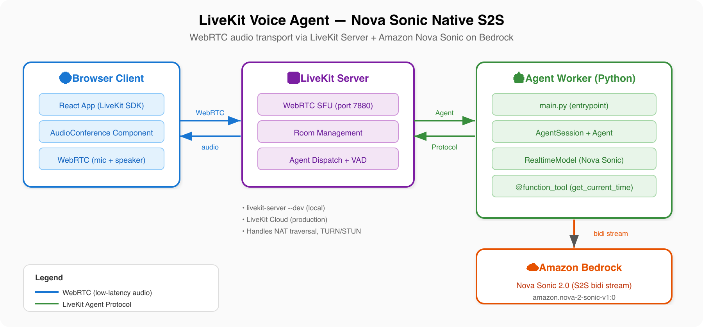

# LiveKit Voice Agent (Nova Sonic)

A real-time voice agent using the [LiveKit Agents](https://docs.livekit.io/agents/) framework with Amazon Nova Sonic 2.0 for native speech-to-speech. LiveKit handles WebRTC audio transport, room management, and client SDKs — Nova Sonic handles bidirectional audio streaming and voice generation.

Based on: [Build real-time conversational AI experiences using Amazon Nova Sonic and LiveKit](https://aws.amazon.com/blogs/machine-learning/build-real-time-conversational-ai-experiences-using-amazon-nova-sonic-and-livekit/)

## Architecture



```
Browser (LiveKit Client SDK)  ←WebRTC→  LiveKit Server  ←Agent Protocol→  Agent Worker  ←Bidi Stream→  Nova Sonic (Bedrock)
```

LiveKit's Agents framework eliminates the need to manage custom audio pipelines or transport layers. LiveKit handles real-time audio routing and session management, while Nova Sonic provides speech understanding and generation. Full-duplex audio, voice activity detection, and noise suppression work out of the box.

## Prerequisites

- Python 3.12+
- AWS credentials with access to Amazon Bedrock (Nova Sonic model)
- [Homebrew](https://brew.sh/) (macOS) or equivalent package manager
- A web browser with WebRTC support (Chrome, Firefox, Edge)

## Quick Start

> **You need 3 terminals** to run this locally:
> 1. **Terminal 1** — LiveKit Server (step 5)
> 2. **Terminal 2** — React UI (step 6)
> 3. **Terminal 3** — Agent Worker (step 7, start last)
>
> Then open `http://localhost:3000` in your browser.

### 1. Install LiveKit server and CLI

**macOS:**
```bash
brew install livekit livekit-cli
```

**Linux:**
```bash
curl -sSL https://get.livekit.io/cli | bash
curl -sSL https://get.livekit.io | bash
```

**Windows (PowerShell):**
```powershell
winget install LiveKit.LiveKitCLI
winget install LiveKit.LiveKitServer
```

### 2. Install uv (Python package manager)

**macOS / Linux:**
```bash
curl -LsSf https://astral.sh/uv/install.sh | sh
```

**Windows (PowerShell):**
```powershell
powershell -ExecutionPolicy ByPass -c "irm https://astral.sh/uv/install.ps1 | iex"
```

### 3. Set up the project

**macOS / Linux:**
```bash
cd livekit-sonic/server
uv venv --python 3.12
source .venv/bin/activate
uv pip install -r requirements.txt
uv pip install --upgrade livekit-plugins-aws
```

**Windows (PowerShell):**
```powershell
cd livekit-sonic\server
uv venv --python 3.12
.venv\Scripts\activate
uv pip install -r requirements.txt
uv pip install --upgrade livekit-plugins-aws
```

> **Note:** Always use the latest `livekit-plugins-aws` — older versions have a timing bug where Nova Sonic times out before audio flows.

### 4. Prepare environment variables

You'll need these when starting the agent worker (step 7):

| Variable | Value |
|----------|-------|
| `AWS_ACCESS_KEY_ID` | Your AWS access key |
| `AWS_SECRET_ACCESS_KEY` | Your AWS secret key |
| `AWS_DEFAULT_REGION` | `us-east-1` |
| `LIVEKIT_URL` | `ws://localhost:7880` (local dev server) |
| `LIVEKIT_API_KEY` | `devkey` (local dev default) |
| `LIVEKIT_API_SECRET` | `secret` (local dev default) |

### 5. Start the LiveKit server (Terminal 1)

```bash
livekit-server --dev
```

Keep this running for the entire session. It proxies audio between the browser and the agent.

### 6. Generate token and start the React UI (Terminal 2)

```bash
# Generate an access token for the browser client
lk token create \
  --api-key devkey --api-secret secret \
  --join --room my-first-room --identity user1 \
  --valid-for 24h
```

Copy the output token, then build and start the UI:

```bash
cd samples/bidi-streaming/livekit-sonic/ui
npm install

# Set the token from above
export REACT_APP_LIVEKIT_TOKEN=your-token-from-above
export REACT_APP_LIVEKIT_SERVER_URL=ws://localhost:7880

# If behind CloudFront proxy (workshop environment), also set:
# export PUBLIC_URL=/proxy/3000

npm start
```

**Workshop environment (behind CloudFront proxy):**

If `npm start` shows an empty page behind the proxy, build and serve with Python instead:

```bash
cd samples/bidi-streaming/livekit-sonic/ui
npm install
export REACT_APP_LIVEKIT_TOKEN=your-token-from-above
export REACT_APP_LIVEKIT_SERVER_URL=ws://localhost:7880
npm run build
python3 serve.py
```

Open `http://localhost:3000` in your browser.

### 7. Start the agent worker (Terminal 3)

Start the agent **after** the UI is connected — the agent joins the room and begins the session.

**macOS / Linux:**
```bash
cd samples/bidi-streaming/livekit-sonic/server
source .venv/bin/activate

# Set environment variables
export AWS_ACCESS_KEY_ID=your-access-key
export AWS_SECRET_ACCESS_KEY=your-secret-key
export AWS_DEFAULT_REGION=us-east-1
export LIVEKIT_URL=ws://localhost:7880
export LIVEKIT_API_KEY=devkey
export LIVEKIT_API_SECRET=secret

python main.py connect --room my-first-room
```

**Windows (PowerShell):**
```powershell
cd livekit-sonic\server
.venv\Scripts\activate

$env:AWS_ACCESS_KEY_ID="your-access-key"
$env:AWS_SECRET_ACCESS_KEY="your-secret-key"
$env:AWS_DEFAULT_REGION="us-east-1"
$env:LIVEKIT_URL="ws://localhost:7880"
$env:LIVEKIT_API_KEY="devkey"
$env:LIVEKIT_API_SECRET="secret"

python main.py connect --room my-first-room
```
```

The React app opens at `http://localhost:3000` with the LiveKit `AudioConference` component — mic capture, speaker output, and participant list built in.

You should now be able to talk to Amazon Nova Sonic in real time.

## Key Components

| File | Purpose |
|------|---------|
| `server/main.py` | Agent worker — connects to LiveKit, creates Nova Sonic session |
| `server/requirements.txt` | Python dependencies |
| `ui/src/App.js` | React client using `@livekit/components-react` with `AudioConference` |
| `ui/package.json` | Node.js dependencies for the React UI |

## How It Works

1. `livekit-server --dev` starts a local LiveKit media server on port 7880
2. `python main.py connect --room my-first-room` starts the agent worker and joins the room
3. The browser connects via WebRTC to the same room using the LiveKit Playground
4. Audio flows: browser mic → LiveKit server → agent worker → Nova Sonic (Bedrock) → agent worker → LiveKit server → browser speaker
5. Nova Sonic handles VAD, turn detection, and speech generation natively

## Configuration

### Voice Selection

Edit `main.py` to change the voice:

```python
session = AgentSession(llm=RealtimeModel(voice="matthew"))
```

Available voices: `tiffany`, `matthew`, `ruth`, `gregory`, `joanna`, and [11 more](https://docs.aws.amazon.com/nova/latest/userguide/available-voices.html).

### Turn Detection

```python
from livekit.plugins.aws.experimental.realtime import RealtimeModel

model = RealtimeModel(turn_detection="MEDIUM")  # HIGH, MEDIUM, or LOW
```

| Setting | Behavior |
|---------|----------|
| `HIGH` | Fast responses, may interrupt slower speakers |
| `MEDIUM` | Balanced (recommended) |
| `LOW` | Patient, waits longer before responding |

## Adding Tools (Function Calling)

```python
from livekit.agents import function_tool

@function_tool()
async def get_weather(location: str) -> str:
    """Get the current weather for a location."""
    return f"The weather in {location} is sunny and 72°F."

agent = Agent(
    instructions="You are a helpful assistant with weather capabilities.",
    tools=[get_weather],
)
```

## Differences from Other Samples

| Aspect | LiveKit | Strands/Pipecat/Sonic |
|--------|---------|----------------------|
| Audio transport | WebRTC (via LiveKit) | WebSocket (base64 PCM) |
| Client | LiveKit Playground or any SDK | Custom HTML client |
| Server | LiveKit media server | FastAPI WebSocket |
| Deployment | LiveKit Cloud or self-hosted | AgentCore Runtime |
| Multi-participant | Native support | Single session per connection |

## Clean Up

This example runs locally — no AWS resources are provisioned beyond Bedrock API calls. Stop the agent worker and LiveKit server processes to stop incurring charges.

## Resources

- [LiveKit Agents Documentation](https://docs.livekit.io/agents/)
- [Nova Sonic Integration Guide](https://docs.livekit.io/agents/integrations/realtime/nova-sonic/)
- [livekit-plugins-aws on PyPI](https://pypi.org/project/livekit-plugins-aws/)
- [AWS Blog: Nova Sonic + LiveKit](https://aws.amazon.com/blogs/machine-learning/build-real-time-conversational-ai-experiences-using-amazon-nova-sonic-and-livekit/)
- [LiveKit Examples GitHub](https://github.com/livekit-examples)
