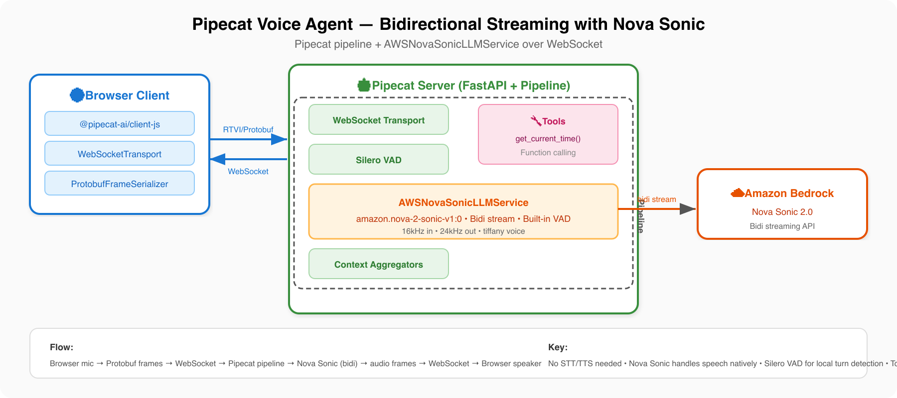

# Pipecat Voice Agent (Nova Sonic)

A bidirectional voice agent using the [Pipecat](https://github.com/pipecat-ai/pipecat) framework with Amazon Nova Sonic for native speech-to-speech. A friendly chatbot with a `get_current_time` tool to demonstrate function calling.

## Architecture



Nova Sonic handles audio input and output natively in a single bidirectional stream — no separate STT/TTS pipeline. Pipecat manages the pipeline orchestration, VAD (Silero), and client transport (RTVI/Protobuf over WebSocket).

## Key Components

| File | Purpose |
|------|---------|
| `websocket/server.py` | Pipecat pipeline with `AWSNovaSonicLLMService`, `get_current_time` tool, FastAPI |
| `client/index.html` | Vite app entry point |
| `client/src/app.js` | Browser client using `@pipecat-ai/client-js` + `WebSocketTransport` |
| `client/vite.config.js` | Vite config with proxy for `/start` endpoint (supports CloudFront prefix) |
| `client/client.py` | Signing server for AgentCore deployment (generates SigV4 presigned URLs) |

## Local Testing

> **You need 2 terminals:** Terminal 1 for the server, Terminal 2 for the Vite client.

### 1. Set up the server (Terminal 1)

**macOS / Linux:**
```bash
cd samples/bidi-streaming/pipecat-sonic/websocket
python3 -m venv .venv
source .venv/bin/activate
pip install -r requirements.txt
```

**Windows (PowerShell):**
```powershell
cd samples\bidi-streaming\pipecat-sonic\websocket
python -m venv .venv
.venv\Scripts\activate
pip install -r requirements.txt
```

### 2. Set environment variables and start the server (Terminal 1)

**macOS / Linux:**
```bash
export AWS_ACCESS_KEY_ID=your-access-key
export AWS_SECRET_ACCESS_KEY=your-secret-key
export AWS_DEFAULT_REGION=us-east-1

python server.py
```

**Windows (PowerShell):**
```powershell
$env:AWS_ACCESS_KEY_ID="your-access-key"
$env:AWS_SECRET_ACCESS_KEY="your-secret-key"
$env:AWS_DEFAULT_REGION="us-east-1"

python server.py
```

The server starts on port 8081.

### 3. Start the client (Terminal 2)

**Local development:**
```bash
cd samples/bidi-streaming/pipecat-sonic/client
npm install
npm run dev
```

**Workshop environment (behind CloudFront proxy):**
```bash
cd samples/bidi-streaming/pipecat-sonic/client
npm install
npm run build
python3 serve.py
```

Open the URL shown (locally `http://localhost:3000`, or the CloudFront proxy URL), then click **Connect**.

Try saying: "What time is it?" — the agent will call the `get_current_time` tool and speak the result.

## Deploy to AgentCore

```bash
pip install -r deployment/agentcore/requirements.txt
export ACCOUNT_ID=123456789012

python deployment/agentcore/deploy.py pipecat-sonic
./deployment/agentcore/start_client.sh pipecat-sonic
```

### Cleanup

```bash
python deployment/agentcore/cleanup.py pipecat-sonic
```

## AgentCore Authentication

When deployed to AgentCore, the browser can't do SigV4 signing. A lightweight Python signing server (`client.py`) generates presigned `wss://` URLs. The Vite dev server proxies `/start` to it.

`start_client.sh pipecat-sonic` handles this automatically — it starts both the signing server and Vite.

To run manually:

```bash
# Terminal 1: signing server
cd samples/bidi-streaming/pipecat-sonic/client
python client.py --runtime-arn arn:aws:bedrock-agentcore:us-east-1:123456789012:runtime/your-runtime-id

# Terminal 2: Vite dev server
cd samples/bidi-streaming/pipecat-sonic/client
npm run dev
```

The client fetches `/start` → Vite proxies to signing server → returns presigned `wss://` URL → client connects directly to AgentCore.

## CloudFront Proxy Support

When running behind a CloudFront proxy (e.g., `https://xxx.cloudfront.net/proxy/3000/`), the Vite config handles the URL prefix automatically. The `/start` endpoint resolves relative to the current page URL.

## Resources

- [Pipecat Framework](https://github.com/pipecat-ai/pipecat)
- [Pipecat AWS Plugin](https://github.com/pipecat-ai/pipecat/tree/main/src/pipecat/services/aws)
- [Amazon Nova Sonic](https://docs.aws.amazon.com/nova/latest/userguide/speech.html)
