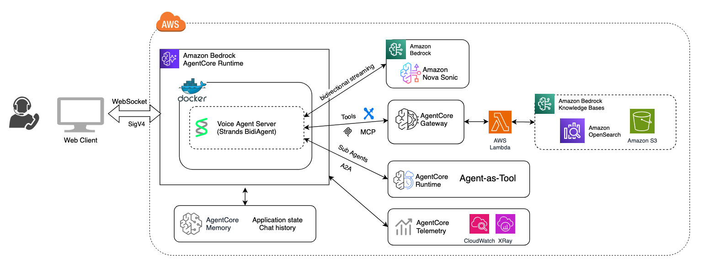

# Strands Voice Agent (Multi-Model Speech-to-Speech)

A bidirectional voice agent supporting three S2S models: **Amazon Nova Sonic**, **Google Gemini 2.5 Flash Native Audio**, and **OpenAI GPT Realtime**. Built with Strands `BidiAgent`, deployed on Amazon Bedrock AgentCore with MCP Gateway tool access and AgentCore Memory for conversation persistence.

## Architecture



The `BidiAgent` manages the bidirectional stream between the client and whichever model is selected per session. All three models process audio input and generate audio output natively — no separate STT/TTS pipeline.

## Supported Models

| Model | ID | API Key | MCP Gateways |
|-------|----|---------|--------------|
| Amazon Nova Sonic | `amazon.nova-2-sonic-v1:0` | No (AWS credentials) | Yes |
| Google Gemini 2.5 Flash | `gemini-2.5-flash-native-audio-preview-12-2025` | `GOOGLE_API_KEY` | Yes |
| OpenAI GPT Realtime | `gpt-realtime` | `OPENAI_API_KEY` | Yes |

The model is selected per session via the client's config modal.

## Key Components

| File | Purpose |
|------|---------|
| `websocket/server.py` | FastAPI server, IMDS credentials, WebSocket endpoint, large event splitting, memory initialization |
| `websocket/agent.py` | Session handler, multi-model BidiAgent setup, profiles, MCP hook, memory-aware output |
| `websocket/tools.py` | In-app tools (`get_current_time`, `get_weather`) |
| `websocket/memory.py` | AgentCore Memory integration (load/store conversation turns) |
| `client/client.py` | HTTP server that serves the HTML client (supports `--ws-url` and `--runtime-arn`) |
| `client/strands-client.html` | Browser-based voice/text client with model selector and config modal |
| `subagents/auth_agent/` | Authentication A2A sub-agent (deployed separately to AgentCore) |
| `subagents/banking_agent/` | Banking operations A2A sub-agent |
| `subagents/mortgage_agent/` | Mortgage services A2A sub-agent |
| `mcp/faq_kb_mcp.py` | FAQ knowledge base MCP server |

## Profiles

The agent supports pre-configured profiles that bundle a system prompt with tool configuration:

| Profile | Tools | Description |
|---------|-------|-------------|
| General Assistant | `get_current_time`, `get_weather` (in-app) | Friendly general-purpose assistant |
| Finance Agent | MCP Gateway tools | Banking customer service with authentication, accounts, mortgage, FAQ |

Profiles are selected per session via the client config event.

## How BidiAgent Works

```python
model = _create_model(config, gateway_arns)  # Nova Sonic, Gemini, or OpenAI

agent = BidiAgent(
    model=model,
    tools=agent_tools,
    system_prompt=system_prompt,
    hooks=[MCPToolPassThroughHook()] if use_mcp else None,
)

await agent.run(inputs=[handle_websocket_input], outputs=[memory_aware_output])
```

- `inputs` — async functions that yield messages from the client (audio chunks, text input)
- `outputs` — the `memory_aware_output` wrapper logs events, stores transcripts to memory, and forwards to the client via `chunked_send_json`

## MCP Gateway Integration

When the Finance Agent profile is selected, tools are accessed via AgentCore MCP Gateways. The `MCPToolPassThroughHook` prevents the BidiAgent from trying to execute MCP tools locally — it cancels local execution and rewrites the result to success so the model stream isn't broken.

Gateway ARNs are configured server-side via the `MCP_GATEWAY_ARNS` environment variable.

## A2A Sub-Agents

The `subagents/` folder contains Strands Agent instances deployed as A2A servers on AgentCore Runtime:

| Sub-Agent | Tools | Model |
|-----------|-------|-------|
| `auth_agent` | `authenticate_user`, `verify_identity` | Nova 2 Lite |
| `banking_agent` | `get_account_balance`, `get_recent_transactions`, `transfer_funds`, `get_account_summary` | Nova 2 Lite |
| `mortgage_agent` | Mortgage rates, calculator, eligibility, status | Nova 2 Lite |

These are deployed separately and accessed via MCP Gateways.

## AgentCore Memory

Conversation persistence is provided by AgentCore Memory. When enabled:

1. On session start, previous conversation turns are loaded and injected into the system prompt as context
2. During the session, final transcripts (user and assistant) are stored to memory in real-time
3. History is sent to the client for display via a `memory_history` event

Memory is enabled per-session via the client config event (`memory_enabled: true`, `actor_id`, `session_id`).

## Large Event Splitting

Audio output events >10KB are split by dividing the `audio` field into smaller chunks aligned to 4-character base64 boundaries. The `chunked_send_json` output wrapper applies this automatically.

## WebSocket Messages (client ↔ server)

### Client → Server

| Type | Fields | Description |
|------|--------|-------------|
| `config` | `voice`, `model_id`, `region`, `input_rate`, `output_rate`, `system_prompt`, `profile`, `api_key`, `memory_enabled`, `actor_id`, `session_id` | Initial session configuration (must be first message) |
| `text_input` | `text` | Text message to send to the agent |
| `bidi_audio_input` | `audio` (base64), `format`, `sample_rate`, `channels` | PCM audio chunk from the microphone |

### Server → Client

| Type | Fields | Description |
|------|--------|-------------|
| `system` | `message`, `memory_available`, `memory_enabled`, `session_id` | Status/config acknowledgment |
| `memory_history` | `turns`, `session_id`, `message` | Previous conversation history from memory |
| `bidi_audio_stream` | `audio` (base64) | Audio output from the model |
| `bidi_transcript_stream` | `text`, `role`, `is_final` | Transcript of user speech or agent response |
| `bidi_interruption` | `reason` | User interrupted the agent (barge-in) |
| `bidi_response_complete` | `response_id`, `stop_reason` | Agent finished responding |
| `bidi_usage` | `inputTokens`, `outputTokens`, `totalTokens` | Token usage stats |
| `tool_use_stream` | `current_tool_use` | Tool invocation in progress |
| `tool_result` | `tool_result` | Tool execution result |
| `error` | `message` | Error message |

## Model Comparison

| Aspect | Nova Sonic | Gemini 2.5 Flash | OpenAI GPT Realtime |
|--------|-----------|------------------|---------------------|
| Audio rates | 16kHz in/out | 24kHz in/out | 24kHz in/out |
| Authentication | AWS credentials | Google API key | OpenAI API key |
| Voice selection | Yes (tiffany, matthew, etc.) | No | No |
| MCP Gateways | Native support | Via BidiAgent | Via BidiAgent |
| Barge-in | Native | Native | Native |

## Local Deployment

Run the WebSocket server and browser client separately on localhost.

### Prerequisites

- Python 3.12+
- AWS credentials configured (`~/.aws/credentials` or environment variables)
- Access to Amazon Bedrock with Nova Sonic enabled in your region

### 1. Start the WebSocket Server

```bash
cd samples/bidi-streaming/strands-sonic/websocket

# Create and activate a virtual environment
python -m venv .venv
source .venv/bin/activate

# Install dependencies
pip install -r requirements.txt

# Set required environment variables
export AWS_DEFAULT_REGION=us-east-1

# Optional: enable MCP Gateway tools (if deployed)
# export MCP_GATEWAY_ARNS='["arn:aws:bedrock-agentcore:us-east-1:123456789:gateway/gw-xxx"]'
# export MCP_GATEWAY_URLS='["https://gateway-url"]'

# Optional: enable AgentCore Memory
# export MEMORY_ID=your-memory-id

# Start the server
python server.py
```

The WebSocket server starts on `ws://localhost:8080/ws`.

### 2. Start the Browser Client

```bash
cd samples/bidi-streaming/strands-sonic/client

# Create and activate a virtual environment (or reuse the one above)
python -m venv .venv
source .venv/bin/activate

# Install dependencies
pip install -r requirements.txt

# Start the client pointing to the local WebSocket server
python client.py --ws-url ws://localhost:8080/ws
```

The client starts on `http://localhost:3000` and opens your browser automatically.

To pre-select a profile:

```bash
python client.py --ws-url ws://localhost:8080/ws --profile "General Assistant"
```

### 3. Use the Voice Agent

1. The browser client opens with the WebSocket URL pre-populated
2. Select a model and voice in the config modal
3. Click **Connect** to establish the session
4. Click the microphone button and start talking

## AgentCore Deployment

Deploy the agent to Amazon Bedrock AgentCore Runtime for a managed, serverless hosting environment. The deployment script handles IAM role creation, MCP Gateway setup, AgentCore Memory, observability, and A2A sub-agents.

### Prerequisites

- Python 3.12+
- AWS credentials configured (`~/.aws/credentials` or environment variables)
- AWS CLI installed and configured
- Docker (for local image builds) or CodeBuild access (default, no Docker required)
- Access to Amazon Bedrock with Nova Sonic enabled in your region

### 1. Deploy to AgentCore

```bash
cd deployment/agentcore

# Create and activate a virtual environment
python3 -m venv .venv
source .venv/bin/activate

# Install deployment dependencies
pip install -r requirements.txt

# Configure AWS credentials (choose one method):

# Option A: Export credentials directly
export AWS_ACCESS_KEY_ID=<your-access-key>
export AWS_SECRET_ACCESS_KEY=<your-secret-key>
export AWS_SESSION_TOKEN=<your-session-token>  # only if using temporary credentials

# Option B: Use an AWS CLI named profile
export AWS_PROFILE=<your-profile-name>

# Option C: Rely on ~/.aws/credentials default profile (no export needed)

# Set required environment variables
export AWS_DEFAULT_REGION=us-east-1
export ACCOUNT_ID=$(aws sts get-caller-identity --query Account --output text)

# Deploy the strands-sonic agent
python3 deploy.py strands-sonic
```

The deploy script will:
- Create an IAM execution role with the required permissions
- Deploy MCP Gateways for tool access (FAQ knowledge base)
- Create AgentCore Memory for conversation persistence
- Set up an observability destination (CloudWatch)
- Build and deploy the WebSocket server container to AgentCore Runtime
- Deploy A2A sub-agents (auth, banking, mortgage)
- Save the deployment configuration to `samples/bidi-streaming/strands-sonic/setup_config.json`

Optional flags:

```bash
# Deploy to a different region
python3 deploy.py strands-sonic --region us-west-2

# Use a custom agent name
python3 deploy.py strands-sonic --agent-name my-voice-agent

# Build the container image locally (requires Docker)
python3 deploy.py strands-sonic --local-build
```

### 2. Start the Browser Client

Once the agent is deployed, `client.py` auto-detects the Runtime ARN from the deployment output (`.bedrock_agentcore.yaml`) and connects via a SigV4 presigned URL.

```bash
cd samples/bidi-streaming/strands-sonic/client

# Create and activate a virtual environment (or reuse the deployment one)
python3 -m venv .venv
source .venv/bin/activate

# Install client dependencies
pip install -r requirements.txt

# Start the client (auto-detects the deployed runtime ARN)
python3 client.py --port 3000
```

If port 3000 is already in use from a previous session:

```bash
# macOS
lsof -ti:3000 | xargs kill -9

# Linux
fuser -k 3000/tcp
```

You can also specify the runtime ARN explicitly:

```bash
python3 client.py --runtime-arn arn:aws:bedrock-agentcore:us-east-1:123456789012:runtime/RUNTIMEID --port 3000
```

### 3. Clean Up

To tear down all deployed resources:

```bash
cd deployment/agentcore
python3 cleanup.py strands-sonic
```

## Environment Variables Reference

| Variable | Required | Description |
|----------|----------|-------------|
| `AWS_DEFAULT_REGION` | Yes | AWS region for Bedrock (e.g., `us-east-1`) |
| `AWS_ACCESS_KEY_ID` | Yes* | AWS access key (*auto-detected from `~/.aws/credentials`) |
| `AWS_SECRET_ACCESS_KEY` | Yes* | AWS secret key (*auto-detected from `~/.aws/credentials`) |
| `MCP_GATEWAY_ARNS` | No | JSON array of MCP Gateway ARNs for tool access |
| `MCP_GATEWAY_URLS` | No | JSON array of MCP Gateway URLs (paired with ARNs) |
| `MEMORY_ID` | No | AgentCore Memory ID for conversation persistence |
| `GOOGLE_API_KEY` | No | Required if using Gemini model |
| `OPENAI_API_KEY` | No | Required if using OpenAI GPT Realtime model |
| `HOST` | No | Server bind address (default: `0.0.0.0`) |
| `PORT` | No | Server port (default: `8080`) |

## Dependencies

```
strands-agents==1.25.0
aws-sdk-bedrock-runtime==0.3.0
bedrock-agentcore>=0.1.0
fastapi==0.123.9
uvicorn[standard]==0.34.2
websockets>=14.0
google-genai>=1.32.0       # Gemini Live
openai>=1.0.0              # OpenAI Realtime
boto3>=1.34.0
opentelemetry-api>=1.20.0
```
