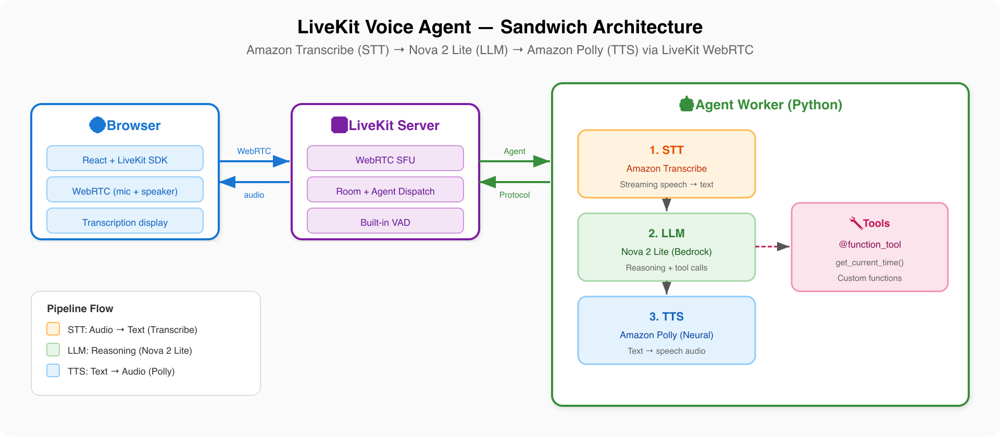

# LiveKit Voice Agent — Cascading Architecture (Transcribe + Nova Lite + Polly)

A voice agent using the [LiveKit Agents](https://docs.livekit.io/agents/) framework with the classic "cascading" pipeline: **Amazon Transcribe** (STT) → **Amazon Nova 2 Lite** (LLM) → **Amazon Polly** (TTS). Unlike the native speech-to-speech approach in `livekit-sonic`, this sample processes audio through three separate stages.

## Architecture



```
Browser  ←WebRTC→  LiveKit Server  ←Agent Protocol→  Agent Worker
                                                        ├── Transcribe (STT: audio → text)
                                                        ├── Nova 2 Lite (LLM: reasoning)
                                                        └── Polly (TTS: text → audio)
```

## Comparison with livekit-sonic

| Aspect | livekit-sonic (Native S2S) | livekit-transcribe-polly (Cascading) |
|--------|---------------------------|-------------------------------------|
| Model | Nova Sonic 2.0 (single model) | Transcribe + Nova Lite + Polly (3 services) |
| Latency | Lower (single API call) | Higher (3 sequential calls) |
| Voice quality | Nova Sonic voices | Polly neural voices |
| VAD | Built into Nova Sonic | LiveKit's built-in VAD |
| Cost | Single model pricing | Three service costs combined |
| Flexibility | Fixed to Nova Sonic capabilities | Mix and match STT/LLM/TTS |

## Prerequisites

- Python 3.12+
- AWS credentials with access to Amazon Bedrock (Nova 2 Lite), Transcribe, and Polly
- [LiveKit server and CLI installed](https://docs.livekit.io/home/self-hosting/local/)

## Quick Start

> **You need 3 terminals:**
> 1. **Terminal 1** — LiveKit Server
> 2. **Terminal 2** — React UI
> 3. **Terminal 3** — Agent Worker (start last)

### 1. Install LiveKit server and CLI (if not already done)

**macOS:**
```bash
brew install livekit livekit-cli
```

**Linux:**
```bash
curl -sSL https://get.livekit.io/cli | bash
curl -sSL https://get.livekit.io | bash
```

### 2. Set up the project

```bash
cd samples/cascading/livekit-transcribe-polly/server
python -m venv .venv
source .venv/bin/activate
pip install -r requirements.txt
pip install --upgrade livekit-plugins-aws
```

### 3. Start the LiveKit server (Terminal 1)

```bash
livekit-server --dev
```

### 4. Generate token and start the UI (Terminal 2)

```bash
# Generate an access token
lk token create \
  --api-key devkey --api-secret secret \
  --join --room my-first-room --identity user1 \
  --valid-for 24h
```

Start the React UI:

```bash
cd samples/cascading/livekit-transcribe-polly/ui
npm install
export REACT_APP_LIVEKIT_TOKEN=your-token-from-above
export REACT_APP_LIVEKIT_SERVER_URL=ws://localhost:7880
npm start
```

Open `http://localhost:3000` and start speaking.

### 5. Start the agent worker (Terminal 3)

Start the agent **after** the UI is connected.

```bash
cd samples/cascading/livekit-transcribe-polly/server
source .venv/bin/activate

# Set environment variables
export AWS_ACCESS_KEY_ID=your-access-key
export AWS_SECRET_ACCESS_KEY=your-secret-key
export AWS_DEFAULT_REGION=us-east-1
export LIVEKIT_URL=ws://localhost:7880
export LIVEKIT_API_KEY=devkey
export LIVEKIT_API_SECRET=secret

python main.py connect --room my-first-room
```

## Key Components

| File | Purpose |
|------|---------|
| `server/main.py` | Agent worker with Transcribe STT + Nova Lite LLM + Polly TTS |
| `server/requirements.txt` | Python dependencies |
| `ui/src/App.js` | React client using `@livekit/components-react` with transcription display |
| `ui/package.json` | Node.js dependencies for the React UI |

## Configuration

### STT (Amazon Transcribe)

```python
stt = aws.STT()  # Uses streaming Transcribe, auto-detects language
```

### LLM (Amazon Nova 2 Lite)

```python
llm = aws.LLM(model="us.amazon.nova-2-lite-v1:0")
```

Other Bedrock models you can use:
- `us.amazon.nova-2-pro-v1:0` — stronger reasoning
- `anthropic.claude-3-5-sonnet-20241022-v2:0` — Claude on Bedrock
- `us.meta.llama3-2-90b-instruct-v1:0` — Llama on Bedrock

### TTS (Amazon Polly)

```python
tts = aws.TTS(voice="Ruth")
```

Available neural voices: `Ruth`, `Matthew`, `Joanna`, `Stephen`, `Ivy`, `Kendra`, `Kimberly`, `Salli`, `Joey`, `Justin`.

## Adding Tools

Same pattern as livekit-sonic:

```python
from livekit.agents import function_tool

@function_tool()
async def get_weather(location: str) -> str:
    """Get the current weather for a location."""
    return f"The weather in {location} is sunny and 72°F."

agent = Agent(
    instructions="You are a helpful assistant.",
    tools=[get_weather],
)
```

## Clean Up

Stop all terminal processes. No AWS resources are provisioned beyond API calls.

## Resources

- [LiveKit Agents Documentation](https://docs.livekit.io/agents/)
- [LiveKit AWS Integration](https://docs.livekit.io/agents/integrations/aws/)
- [Amazon Transcribe](https://aws.amazon.com/transcribe/)
- [Amazon Polly](https://aws.amazon.com/polly/)
- [Amazon Bedrock](https://aws.amazon.com/bedrock/)
