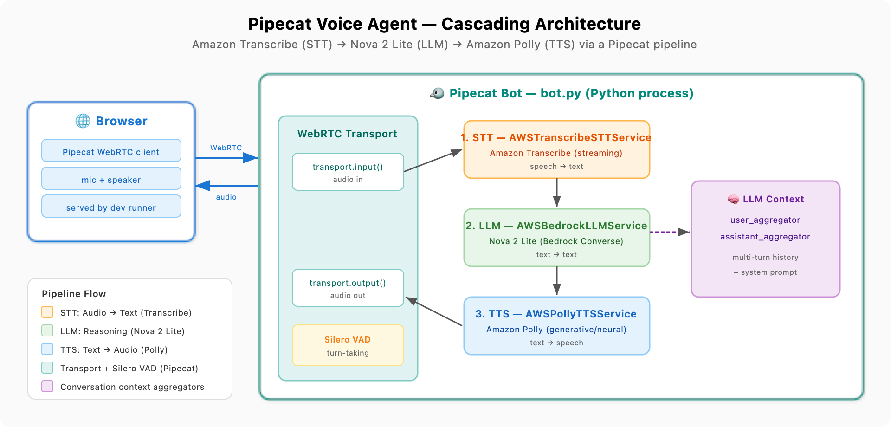

# Pipecat Voice Agent — Cascading Architecture (Transcribe + Nova 2 Lite + Polly)

A voice agent using the [Pipecat](https://github.com/pipecat-ai/pipecat) framework with the classic "cascading" pipeline: **Amazon Transcribe** (STT) → **Amazon Nova 2 Lite** (LLM) → **Amazon Polly** (TTS). Unlike the native speech-to-speech approach in `pipecat-sonic`, this sample processes audio through three separate stages, wired together as a Pipecat pipeline of frame processors.

## Architecture



```
browser mic
    │  (WebRTC audio frames)
    ▼
transport.input()
    ▼
AWSTranscribeSTTService     # speech → text   (Amazon Transcribe streaming)
    ▼
user_aggregator             # add user turn to conversation context
    ▼
AWSBedrockLLMService        # text → text     (Amazon Nova 2 Lite, Converse)
    ▼
AWSPollyTTSService          # text → speech   (Amazon Polly)
    ▼
transport.output()
    ▼
assistant_aggregator        # add bot turn to conversation context
    │  (WebRTC audio frames)
    ▼
browser speakers
```

Pipecat owns the hard parts of real-time voice: WebRTC audio transport, Silero voice-activity detection, turn-taking, interruption handling, and frame scheduling between the three services. You just declare the pipeline — the order of processors *is* the data flow.

## Prerequisites

- Python 3.11+ (Pipecat requirement)
- AWS credentials with access to Amazon Transcribe, Bedrock (Nova 2 Lite enabled in *Model access*), and Polly
- A region where all three are available. `us-east-1` works; note Polly's `generative` engine is region-limited (fall back to `neural` if needed).

## Setup

```bash
cd samples/cascading/pipecat-transcribe-polly/server
python -m venv .venv
source .venv/bin/activate
pip install -r requirements.txt
cp .env.example .env   # then edit, or rely on your existing AWS profile/SSO
```

## Run

```bash
python bot.py
```

Pipecat's development runner starts a local WebRTC server and prints a URL:

```
🚀 Bot ready!
   → Open: http://localhost:7860
```

Open it in your browser, allow microphone access, and click **Connect**. The agent greets you, then you can talk. First launch takes ~20s while Pipecat downloads the Silero VAD model; subsequent runs are fast.

> The browser client is served automatically by Pipecat's `webrtc` dev transport — there's no separate JavaScript build to run.

## Key Components

| File | Purpose |
|------|---------|
| `server/bot.py` | Pipecat pipeline: Transcribe STT + Nova 2 Lite LLM + Polly TTS, plus session lifecycle |
| `server/requirements.txt` | Python dependencies (`pipecat-ai` with AWS + Silero + transport extras) |
| `server/.env.example` | Environment variable template (region, model, voice, language) |

`server/bot.py` is organized into three clearly separated parts:

1. **Service construction** — `AWSTranscribeSTTService`, `AWSBedrockLLMService` (Nova 2 Lite), and `AWSPollyTTSService`, each configured from environment variables.
2. **Pipeline assembly** — the ordered list of processors. The order is the data flow; audio must be transcribed before the LLM sees it and synthesized before playback.
3. **Lifecycle** — `on_client_connected` seeds a greeting, `on_client_disconnected` tears the pipeline down.

## Configuration

All configuration is via environment variables (see `.env.example`):

| Variable | Default | Notes |
|----------|---------|-------|
| `AWS_REGION` | `us-east-1` | Region for all three services. |
| `NOVA_MODEL_ID` | `us.amazon.nova-2-lite-v1:0` | Bedrock cross-region inference profile. |
| `POLLY_VOICE_ID` | `Ruth` | Any Polly voice. Generative voices: `Ruth`, `Matthew`, `Stephen`, `Amy`. |
| `POLLY_ENGINE` | `generative` | Set to `neural` if generative isn't available in your region. |
| `TRANSCRIBE_LANGUAGE` | `en-US` | Transcribe streaming language code. |

### STT (Amazon Transcribe)

```python
stt = AWSTranscribeSTTService(
    region=AWS_REGION,
    settings=AWSTranscribeSTTService.Settings(language=_language(TRANSCRIBE_LANGUAGE)),
)
```

### LLM (Amazon Nova 2 Lite)

```python
llm = AWSBedrockLLMService(
    model=NOVA_MODEL_ID,
    aws_region=AWS_REGION,
    settings=AWSBedrockLLMService.Settings(temperature=0.7, top_p=0.9, max_tokens=1024),
)
```

Any Bedrock text model that supports the Converse API can drop in here — same `AWSBedrockLLMService`, just a different `model` ID. For the current list of model IDs and their cross-region inference profiles, see [Supported foundation models in Amazon Bedrock](https://docs.aws.amazon.com/bedrock/latest/userguide/models-supported.html).

### TTS (Amazon Polly)

```python
tts = AWSPollyTTSService(
    region=AWS_REGION,
    settings=AWSPollyTTSService.Settings(
        voice=POLLY_VOICE, engine=POLLY_ENGINE, language=_language(TRANSCRIBE_LANGUAGE),
    ),
)
```

## Swapping Providers

Pipecat's value is that providers are interchangeable. To experiment, change one service line and its import — the rest of the pipeline is unchanged. For example, swap Transcribe for Deepgram (`DeepgramSTTService`), Nova for another Bedrock model (still `AWSBedrockLLMService`, different `model`), or Polly for ElevenLabs (`ElevenLabsTTSService`). Add the matching `pipecat-ai[...]` extra to `requirements.txt` and the relevant API key to `.env`.

## Deploy

This `server/bot.py` is compatible with Pipecat Cloud without code changes. See the [Pipecat deployment docs](https://docs.pipecat.ai/pipecat-cloud/introduction). For an AWS-hosted variant (FastAPI + WebSocket + AgentCore), see the [pipecat-sonic](../../bidi-streaming/pipecat-sonic/) sample in this repo.

## Troubleshooting

- **Polly `ValidationException` on engine** — `generative` isn't in your region; set `POLLY_ENGINE=neural` or change `AWS_REGION`.
- **Bedrock `AccessDeniedException`** — enable Nova 2 Lite in the Bedrock *Model access* page and confirm the `bedrock:InvokeModel` permission.
- **No transcript / no response** — check the browser granted mic access and that your AWS credentials are valid (`aws sts get-caller-identity`).
- **First run is slow** — Silero VAD downloads on first launch; subsequent runs are fast.

## Resources

- [Pipecat Framework](https://github.com/pipecat-ai/pipecat)
- [Pipecat AWS Plugin](https://github.com/pipecat-ai/pipecat/tree/main/src/pipecat/services/aws)
- [Amazon Transcribe](https://aws.amazon.com/transcribe/)
- [Amazon Polly](https://aws.amazon.com/polly/)
- [Amazon Bedrock](https://aws.amazon.com/bedrock/)
